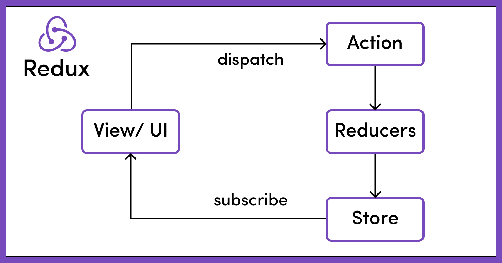

## 8/8/2023


# What is Redux?

Redux is a popular Javascript library used to manage state in web applications. 


#### Advantages of using Redux
The main advantage of using Redux is that it provides a predictable way to manage state in your application. By making all state changes go through a central store, it’s easier to understand how the application’s state is modified. 

#### Disadvantages of using Redux
One major downside of Redux is that it adds a lot of extra boilerplate code. You need to set up a store and manage reducers, in addition to your regular code. This adds complexity to your application, meaning more setup time and maintenance. 

### 3 main concepts of Redux

1. Store
2. Actions
3. Reducers



### Redux action

An action, is an object that contains two essential properties, 

**type:** A string that describes the type of action being performed. It's like a label that indicates what kind of state change is happening.

**payload:** Additional data that may be required to update the state. This data can be of any type and is used to carry the necessary information for the state change.


Example of a Redux Action: 

```
const incrementCounter = {
  type: 'INCREMENT_COUNTER',
  payload: 1
  };
  
  ```

**In this example, the action is named "INCREMENT_COUNTER," and it carries a payload of 1, which might represent the amount by which the counter needs to be incremented.**


